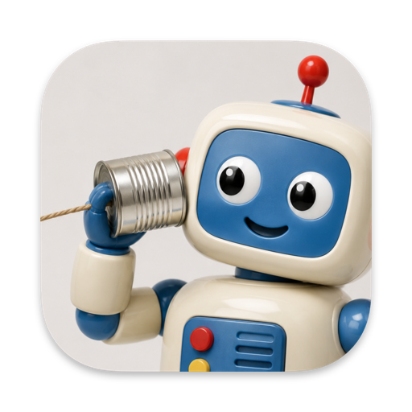
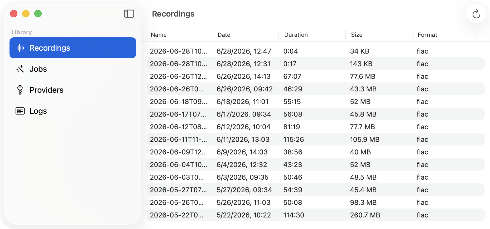
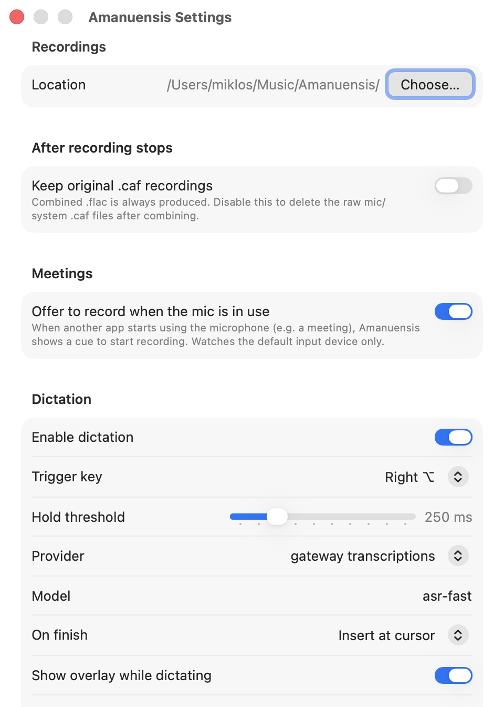

<p align="center">
  
</p>

# Amanuensis

> **amanuensis** · /əˌmæn.juˈen.sɪs/ · *noun*
>
> a person whose job is to write down what another person says or to copy what another person has written

A menu-bar audio recorder and transcription pipeline for macOS. It records your
microphone and other apps' system audio at once, with no virtual audio driver,
and saves everything locally. From there, a recording can optionally go to a
transcription or audio-capable model of your choice.

## Why Amanuensis?

- **Cloud-first, no multi-gigabyte local model.** Most Mac "Whisper apps" make
  you download a model before you can transcribe anything. Amanuensis bundles
  none. Point it at whatever cloud provider you want, or an OpenAI-compatible
  endpoint you run yourself, and you get the latest models without the local
  compute and disk cost. You're not tied to one vendor.
- **Minimal privileges.** It runs under the App Sandbox with the Hardened
  Runtime and asks only for what it needs. API keys live in your macOS Keychain,
  recordings and settings stay on disk under your control, and nothing leaves
  your machine unless you configure a job that sends it. See
  [Permissions](#permissions-the-app-requests) for the full breakdown.
- **Free and open source (MIT).** No subscription, no account, no telemetry, and
  you can audit the whole thing. PRs and feature requests welcome.

A few more things that make it pleasant:

- **Recording is the product.** Transcription is one optional pipeline stage, not
  the point of the app.
- **No kernel extension, no BlackHole.** Your mic and other apps' audio are
  captured together through the macOS Core Audio process-tap API.
- **Push-to-talk dictation.** Hold a modifier key, speak, and the transcript is
  inserted at your cursor.
- **Signed and notarized.** Release builds are Developer ID–signed and notarized
  by Apple, so they open straight from Gatekeeper, without the usual right-click
  workaround or "unidentified developer" warning.

> Naming note: the app ships as **Amanuensis** (`work.miklos.amanuensis`). The
> Xcode project/target/scheme and the internal SPM modules keep their original
> `Amanuensis`/`AudioPipeline` names; the git repo directory is still
> `audio-pipeline/`. This is cosmetic.

## Screenshots

The Recordings library, with each capture's date, duration, size, and format:

<p align="center">
  
</p>

Settings: where recordings are saved, what happens after a recording stops, the meeting record cue, and dictation:

<p align="center">
  
</p>

## Requirements

- macOS 26.3 (Tahoe) or later. The system-audio process-tap API needs a recent
  macOS, and the build targets 26.3.
- Apple Silicon or Intel. Releases ship separate `arm64` and `x86_64` builds, so
  grab the one that matches your Mac.
- Xcode 26 / Swift 6.2 to build from source.

## Build & run

There is no Xcode workspace, only the `.xcodeproj`:

```bash
xcodebuild -project Amanuensis.xcodeproj -scheme Amanuensis -configuration Debug build
```

Or open `Amanuensis.xcodeproj` in Xcode and press ⌘R. To find the built app:

```bash
xcodebuild -project Amanuensis.xcodeproj -scheme Amanuensis -configuration Debug \
  -showBuildSettings | grep BUILT_PRODUCTS_DIR
open <BUILT_PRODUCTS_DIR>/Amanuensis.app
```

See [`CLAUDE.md`](CLAUDE.md) for the test surfaces and project structure details.

## Permissions the app requests

Amanuensis runs under the **App Sandbox** with the **Hardened Runtime**, and asks
only for what it needs. For the full breakdown, with the exact entitlement keys
and where each one is declared, see [`docs/permissions.md`](docs/permissions.md).

### Entitlements (granted at build/install time)

| Entitlement | Why |
|---|---|
| App Sandbox (`com.apple.security.app-sandbox`) | Runs the app sandboxed. |
| Network client (`com.apple.security.network.client`) | Outbound calls to the transcription / audio-understanding APIs you configure. No network traffic happens otherwise. |
| Audio input (`com.apple.security.device.audio-input`) | Microphone capture and the Core Audio process tap. |
| Music assets read/write (`com.apple.security.assets.music.read-write`) | Promptless access to `~/Music`; the default recordings folder is `~/Music/Amanuensis`. |
| User-selected files read/write (`com.apple.security.files.user-selected.read-write`) | Read/write a recordings folder you pick yourself, remembered as a security-scoped bookmark. (Injected via the `ENABLE_USER_SELECTED_FILES` build setting, not the entitlements plist.) |

### Runtime permissions (you approve these via system prompts / System Settings)

| Permission | Why |
|---|---|
| **Microphone** | Record the mic, and capture audio for dictation. Asked the first time you record. |
| **System Audio Capture** | Capture other apps' audio output through the Core Audio process tap. Without it, the system track records silence. |
| **Input Monitoring** | A listen-only global key tap that detects the dictation trigger key. It observes; it never consumes or logs keystrokes. |
| **Accessibility (post events)** | Synthesize a ⌘V to paste dictated text at your cursor. This is the narrow "post events" capability, not full Accessibility control. |

The System Audio Capture grant uses a private TCC API, which is the one thing
keeping Amanuensis off the Mac App Store today; every other permission is
App-Store-compatible.

## Providers supported out of the box

Amanuensis ships with the providers below preconfigured (base URLs, suggested
models, field hints). They're all bring-your-own-key: you add your API key, and
it lives in the Keychain. The two "OpenAI-compatible" entries are generic, so you
can point them at any endpoint that speaks the OpenAI API (a self-hosted server,
LM Studio, a gateway). Providers are defined as plain data in
[`presets.json`](Packages/AudioPipeline/Sources/AudioPipelineJobs/Resources/presets.json),
and you can add your own from the in-app Providers UI.

### Speech-to-text (transcription)

| Provider | Suggested models | Notes |
|---|---|---|
| OpenAI Whisper | `whisper-1` | Prompt biases spelling/style only (~224 tokens). |
| OpenAI gpt-4o-transcribe | `gpt-4o-transcribe`, `gpt-4o-mini-transcribe` | Follows free-text instructions (no 224-token cap). |
| Groq Whisper | `whisper-large-v3`, `whisper-large-v3-turbo` | Upload cap 25 MB (free) / 100 MB (paid). |
| Mistral Voxtral | `voxtral-mini-2602` | No prompt parameter. |
| Cohere | `cohere-transcribe-03-2026` | Requires a language code per request; no prompt. |
| ElevenLabs Scribe | `scribe_v2`, `scribe_v1` | Speaker diarization on by default. |
| Soniox Async | `stt-async-v5` | Upload → poll → fetch; speaker diarization; context prompting. |
| Deepgram | `nova-3`, `nova-2` | Keyterm prompting on Nova-3; smart formatting. |
| OpenAI-compatible Transcription | — | Any OpenAI-style `/audio/transcriptions` endpoint. |

### Audio-capable chat / multimodal

These take the audio plus a free-text instruction and return Markdown (e.g.
"transcribe and summarize this meeting").

| Provider | Suggested models | Notes |
|---|---|---|
| OpenAI Chat (audio) | `gpt-4o-audio-preview` | 128K-token context. |
| Gemini | `gemini-2.5-flash`, `gemini-2.5-pro` | ~1M-token context; native Gemini API. |
| Gemini (OpenAI-compatible) | `gemini-2.5-flash`, `gemini-2.5-pro` | Gemini via its OpenAI-compatible surface. |
| OpenRouter | — | Route to any OpenRouter-hosted model. |
| OpenAI-compatible Chat | — | Any OpenAI-style `/chat/completions` endpoint. |

## Contributing

PRs and feature requests are welcome. Open an issue or a pull request.

## License

[MIT](LICENSE) © 2026 Miklos Petravich
